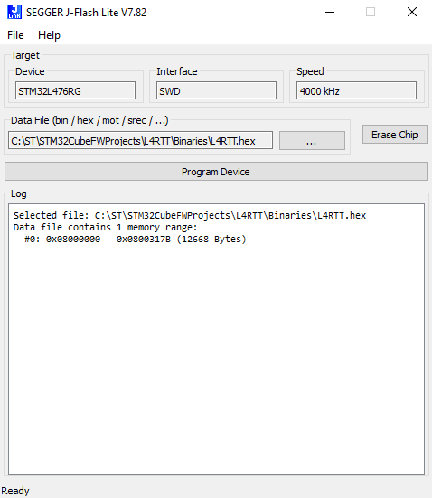
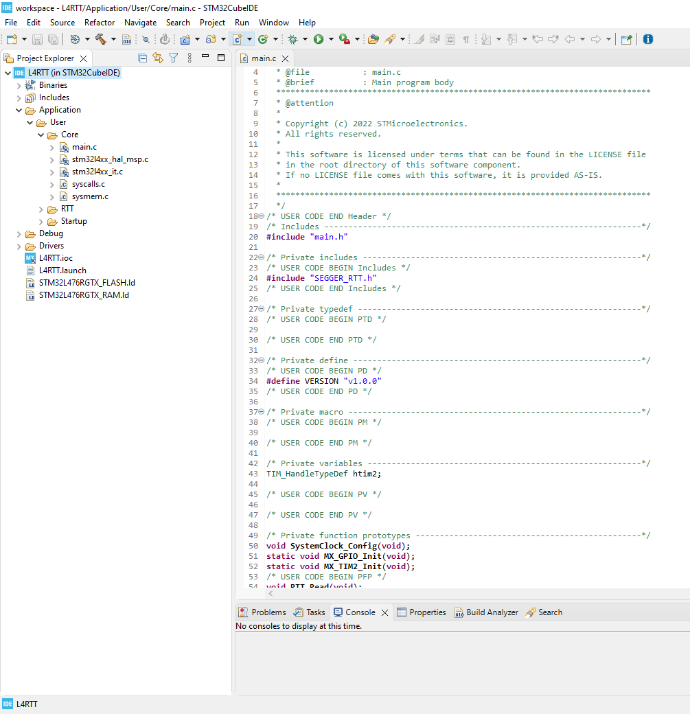
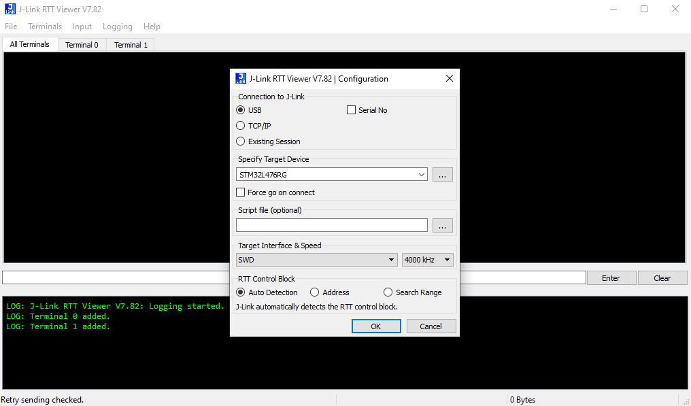
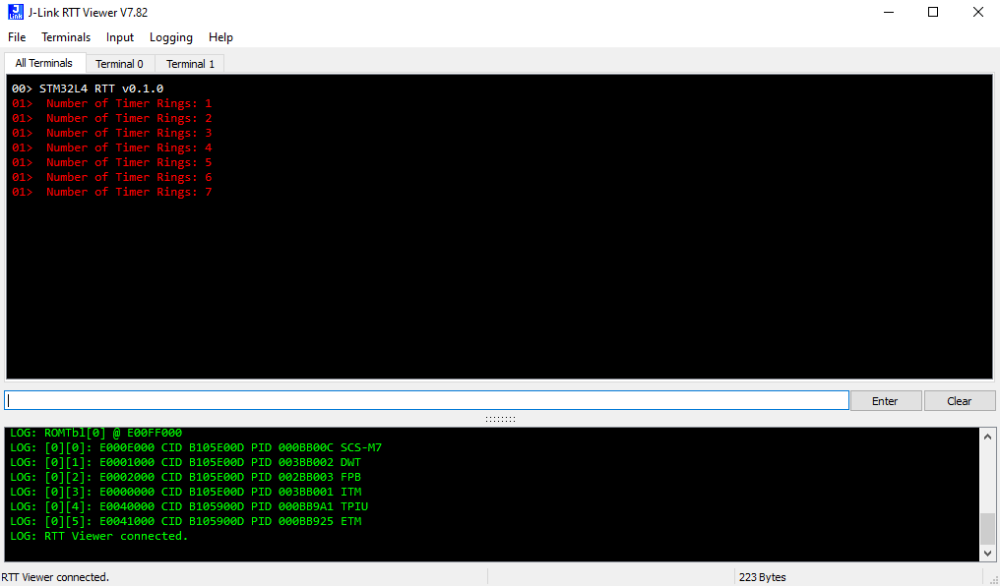
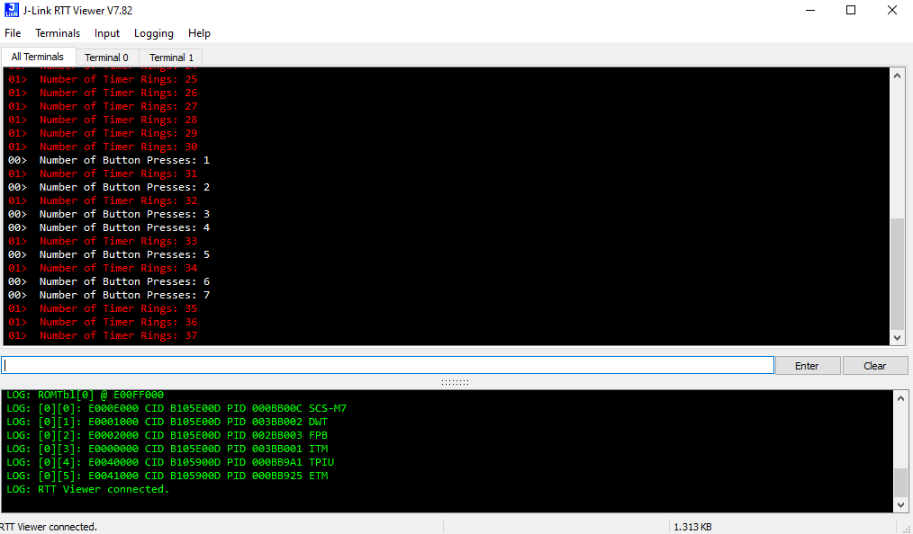
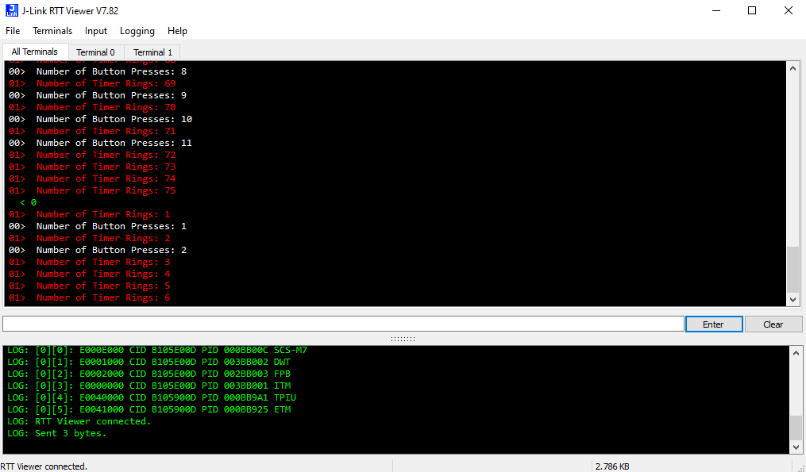

# STM32L4-J-LINK-RTT

* The STM32L4-J-LINK-RTT is a simple application example that aims to demonstrate how to use [SEGGER's RTT](https://wiki.segger.com/RTT) with an STM32L4 project.
* This example works with SEGGER's [RTT Viewer](https://www.segger.com/products/debug-probes/j-link/tools/rtt-viewer/) PC application to send and recieve data using SEGGER RTT.
* The embedded application will send the following to the HOST PC:
    * Number of USER-B1 button presses on terminal 0.
    * Number of TIM2 timer rings sent periodically every 1 second on terminal 1.
* The user may send a '0' to the embedded device using RTT Viewer on the HOST PC to reset the 2 number values.

## Hardware Needed

  * One [NUCLEO-L476RG](https://www.st.com/en/evaluation-tools/nucleo-l476rg.html)

  * One SEGGER [J-Link / J-Trace Debug Probe](https://www.segger.com/products/debug-trace-probes/) (Optional)
    * The Hardware Debug Probe is optional if you use the [ST-Link Reflash Utility](https://www.segger.com/products/debug-probes/j-link/models/other-j-links/st-link-on-board/) instead.

## Software Needed

  * Prebuilt firmware image: L4RTT.hex (STM32L4-J-LINK-RTT\Binaries)

  * [J-Link Software Pack](https://www.segger.com/downloads/jlink/)

  * [ST-Link Reflash Utility](https://www.segger.com/products/debug-probes/j-link/models/other-j-links/st-link-on-board/) (Optional)
    * This tool is optional if you use the Hardware Debug Probe instead.

## User's Guide

1) Setup the J-Link with the NUCLEO-L476RG using one of the 2 options below:

    a) Connect a Hardware J-Link debug probe to the Nucleo board. Follow this [WIKI](https://wiki.segger.com/UM08001_J-Link_/_J-Trace_User_Guide#:~:text=2%2D215882%2D0-,Pinout%20for%20SWD,-J%2DLink%20/%20J) for the SWD connection.

    b) Use the ST-Link Reflash Utility to convert the on-board ST Link to a J-Link.

    > Note: Not all STM32 devices are compatible with this tool, please check compatibility [here](https://www.segger.com/products/debug-probes/j-link/models/other-j-links/st-link-on-board/#:~:text=LINK%20on%2Dboard%3A-,Compatible%20Evaluation%20Boards,-The%20following%20evaluation). 

    

2) Flash the application firmware on to the nucleo board using one of the 2 options below:

    a) Use [J-Flash LITE](https://www.segger.com/products/debug-probes/j-link/technology/flash-download/#:~:text=statistics%20upon%20success.-,J%2DFlash%20LITE,-J%2DFlash%20Lite) included with the [J-Link Software Pack](https://www.segger.com/downloads/jlink/) to download the hex file on to the Nucleo board.

    

    b) Open your preferred IDE (Keil MDK-ARM, IAR EWARM, or STM32CubeIDE) and build & run the project to download it on to the Nucleo board.

    

3) Open RTT Viewer from the [J-Link Software Pack](https://www.segger.com/downloads/jlink/) and connect to the Nucleo board.

4) Once the application example has started, you will see an initial message. You will also see a timer message every 1 second on terminal 1.

    > Note: You may need to press the black RESET-B2 button to start the application example.

5) Press the blue USER-B1 button to send a button message on terminal 0.

6) Type '0' in the RTT Viewer input to send a '0' to the embedded device. This will reset the button & timer number values.

## Troubleshooting

**Caution** : Issues and the pull-requests are **not supported** to submit problems or suggestions related to the software delivered in this repository. The STM32L4-J-LINK-RTT example is being delivered as-is, and not necessarily supported by ST.

**For any other question** related to the product, the hardware performance or characteristics, the tools, the environment, you can submit it to the **ST Community** on the STM32 MCUs related [page](https://community.st.com/s/topic/0TO0X000000BSqSWAW/stm32-mcus).